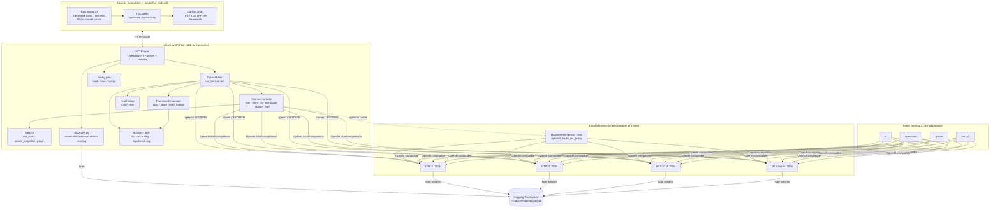
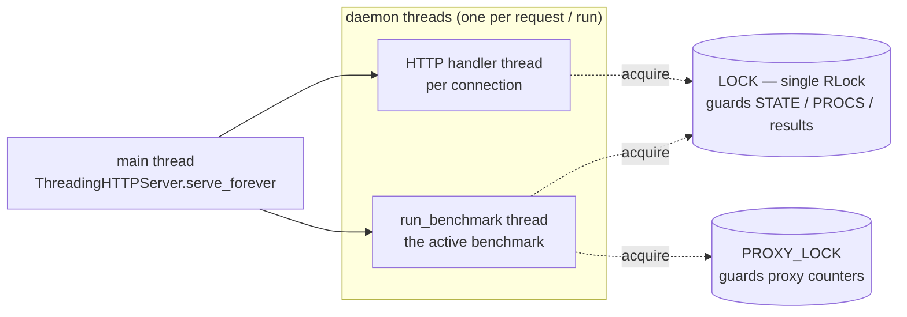
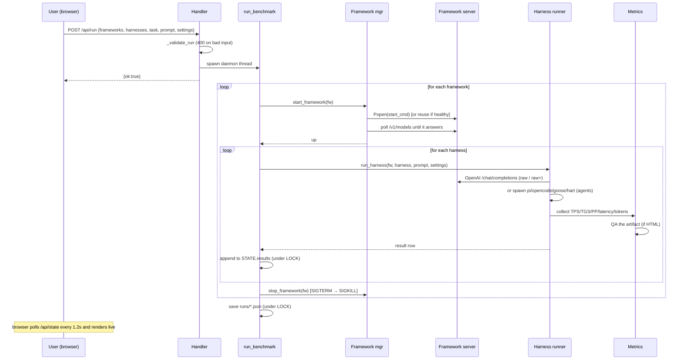
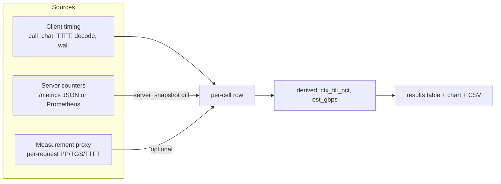
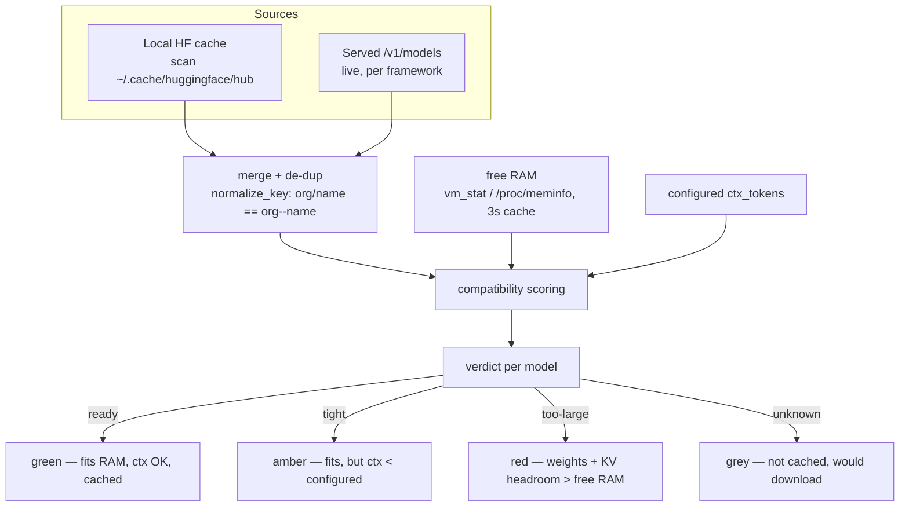

# benching — Architecture

A single-process, stdlib-only Python backend serves a single-file HTML dashboard and
orchestrates local LLM inference frameworks and agent harnesses. This document is the
authoritative map of the system.

## 1. High-level component diagram



## 2. Process & threading model



- **One process, many threads.** `ThreadingHTTPServer` gives each HTTP connection its
  own thread. The benchmark itself runs on a single daemon thread spawned by
  `POST /api/run`.
- **One global `LOCK` (RLock)** serializes all reads/writes of shared state
  (`STATE`, `PROCS`, `FW_LOGS`, results). Handlers take it for short critical sections;
  the orchestrator takes it around state transitions. Long work (subprocess waits,
  HTTP calls) is done **outside** the lock.
- **`PROXY_LOCK`** separately guards the measurement proxy's counters/log.
- **`RUN_FLAG` (Event)** is the stop signal: `POST /api/stop` clears it; the
  orchestrator checks it between cells and the harness runners check it while polling
  subprocesses, so Stop works mid-flight.

## 3. A benchmark run, step by step



## 4. The six harnesses

| Harness | What it is | How it's driven | Metrics source |
|---------|-----------|-----------------|----------------|
| **raw** | One-shot OpenAI `/chat/completions` call | `call_chat()` (urllib, streaming) | client-measured TTFT/decode; server counters where available |
| **raw+** | raw with automatic continuation on `finish_reason=length` | `rawplus_generate()` — re-issues with the tail + a "continue at the cut point" instruction, de-dups the seam | client-measured, summed across rounds |
| **pi** | pi coding agent | `pi --print --provider bench --model …` with an **isolated** `PI_CODING_AGENT_DIR` | agent stdout + `HART_RESULT`-style totals |
| **opencode** | opencode agent | `opencode run --dir <workdir> --model bench/<id>` with isolated `XDG_CONFIG_HOME` | agent stdout + artifact |
| **goose** | goose agent | `goose run -t <prompt>` with isolated `XDG_CONFIG_HOME` + `OPENAI_BASE_URL` | agent stdout + artifact |
| **hart** | the `hart` agentic harness | `python3 <hart_path>` (config from `hart_path`) | `HART_RESULT {…}` line on stdout |

All agent harnesses are pointed at the framework via an **OpenAI-compatible base URL**
(`http://127.0.0.1:<port>/v1`) and a throwaway API key. Each gets an **isolated config
dir** under `harness-configs/` so the user's global agent configs are never touched.

## 5. Metrics pipeline



- **Client timing** (`call_chat`) measures TTFT (time to first token) and decode time
  directly from the streaming response, and reports `wall` (total) so raw+ can compute
  an honest decode rate.
- **Server counters** (`server_snapshot` / `server_cell_delta`) read the framework's
  metrics endpoint (JSON `/metrics` for MLX-VLM, Prometheus text for MLX-Serve) before
  and after a cell and diff the counters — giving true server-side PP/TGS.
- **Measurement proxy** (optional, `route_via_proxy: true`) sits between the agent
  harnesses and the framework and records per-request PP/TGS/TTFT, so agent rows get
  the same metric depth as raw rows.
- **Derived** values: `ctx_fill_pct` (prompt tokens / configured window) and
  `est_gbps` (TGS × weight size) as an effective-bandwidth estimate.

## 6. Model discovery & compatibility

`discovery.py` answers "which models can this machine actually run right now?":



- **Two sources, de-duplicated.** The live `/v1/models` (authoritative while a server
  runs) is merged with the local HF cache. Served ids use `org--name`; cache ids use
  `org/name`; `normalize_key()` maps both to the same cache-dir key so they collapse.
- **RAM fit** uses `size_gb × 1.25` (weights + KV cache + engine overhead) vs current
  free RAM. Free RAM is read from `vm_stat` (macOS) or `/proc/meminfo` (Linux) and
  cached for 3s (the UI polls every 1.2s).
- **Context fit** reads the model's declared context from the cached `config.json`
  (top-level or nested `text_config` for multimodal models) and compares to the
  configured window.
- **MTP draft** detection surfaces a cached speculative-decoding draft matching the base
  model, so the UI can show it.

## 7. Configuration & persistence

```mermaid
flowchart LR
    DEF[Built-in DEFAULT_CONFIG] --> MG[_merge_config]
    EX[config.example.json] -->|first run: seed| CJ[config.json]
    CJ --> MG
    MG --> LIVE[CONFIG (in memory)]
    LIVE -->|POST /api/models/select| CJ
    LIVE --> FW[FRAMEWORKS dict]
```

- **Layered config.** Built-in defaults ← `config.json` (per-machine). Frameworks are
  merged per-framework so a partial `config.json` only overrides what it names.
- **Self-seeding.** On first run, `config.json` is copied from `config.example.json`
  so users can discover and edit it.
- **Live model selection.** `POST /api/models/select` updates the in-memory config and
  persists it back to `config.json` — the UI's model picker writes real config.
- **Run history.** Each completed run is saved to `runs/<timestamp>.json` with the full
  config snapshot (so results are reproducible) and all result rows.

## 8. Security & robustness posture

- **Local-only by default.** `host: 127.0.0.1`; the server logs a loud warning if you
  bind to `0.0.0.0`.
- **Input validation.** `POST /api/run` is validated (`_validate_run`) before a thread
  is spawned; bad input → HTTP 400, not a 500. All JSON bodies are size-capped.
- **No global config mutation.** Agent harnesses use isolated config dirs
  (`PI_CODING_AGENT_DIR`, per-harness `XDG_CONFIG_HOME`) — the user's `~/.pi`,
  `~/.config/opencode`, etc. are never written.
- **Graceful failure.** Every HTTP route is wrapped so errors return JSON (never an HTML
  traceback). Framework start/stop is SIGTERM→SIGKILL with process-group kills. A
  `SIGTERM` to the server shuts down any frameworks it spawned.
- **No secrets.** The throwaway API key is the literal string `bench`; there is no
  network egress except to `127.0.0.1` and (for discovery) the local HF cache.
